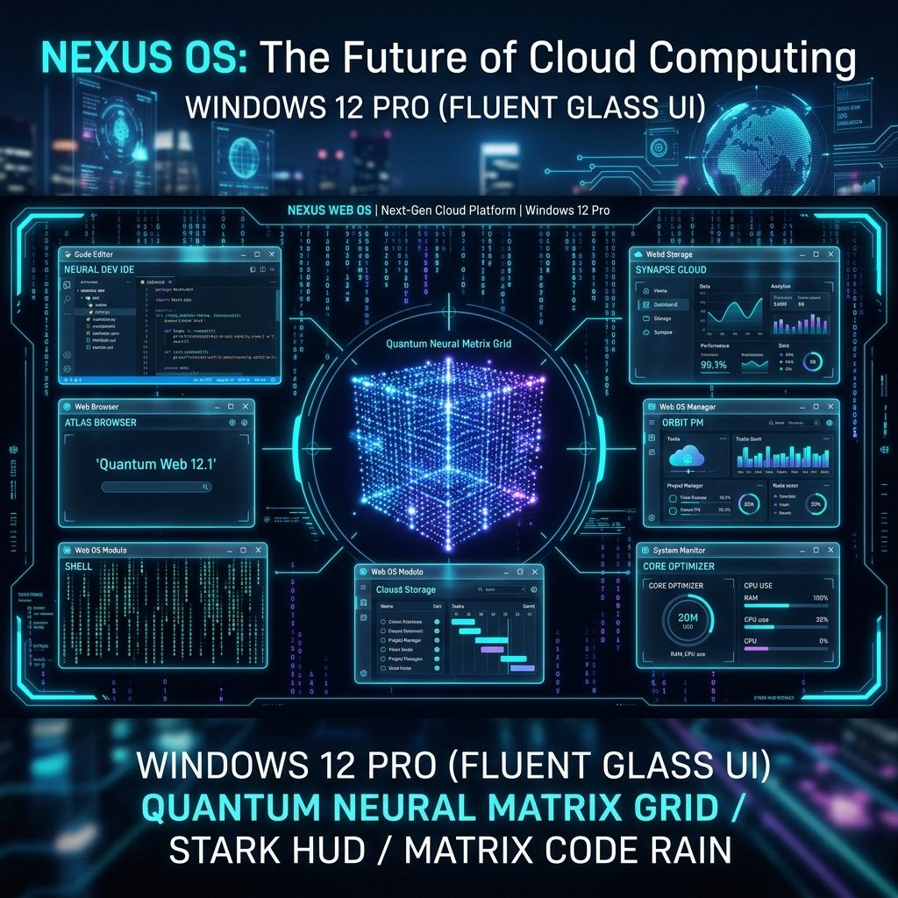
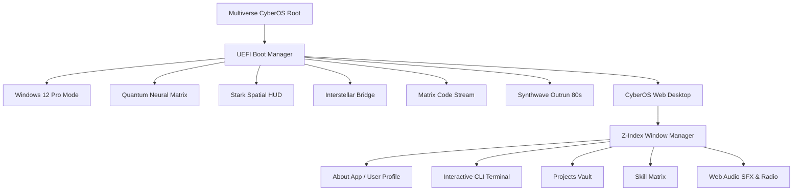

<div align="center">



# 🚀 Multiverse CyberOS v2.088 — Interactive Web Operating System Portfolio

[](https://react.dev/)
[](https://www.typescriptlang.org/)
[](https://vitejs.dev/)
[](https://tailwindcss.com/)
[](./LICENSE)

**An ultra-interactive 7-in-1 Multiverse Web Operating System Portfolio built by Santosh Maurya.**

[🌐 View Live OS Experience](http://localhost:5175/) • [📄 Explore Projects](#-featured-production-projects) • [📫 Get In Touch](#-contact--connect)

</div>

---

## 👨‍💻 Operator Overview

<div align="center">
  
  
  ### **Santosh Maurya**
  **Software Support Engineer & FullStack Web Developer**  
  📍 Delhi NCR, India  
  
  🎓 **B.E. Information Technology (2025 Batch)** — *Savitribai Phule Pune University (SPPU)* • **7.99 CGPA**  
  💼 **Trainee Software Support Engineer** — *Nevitech Data Solutions Pvt Ltd* (Supporting NCampus CMS)
</div>

---

## 🌌 The 7 Multiverse OS Environments

This portfolio isn't just a static webpage—it is a fully functional web operating system featuring **7 distinct UI universes**, each engineered with its own aesthetic, theme engine, audio feedback, and window renderer:

| OS Environment | Visual Style & Theme Engine | Core Features |
| :--- | :--- | :--- |
| 🪟 **Windows 12 Pro Edition** | Modern Mica Glass, Centered Taskbar, Blue Bloom Wallpaper | Windows Start Menu, Pinned Apps, Widgets, Taskbar System Tray |
| 🌀 **Quantum Neural Matrix v3.0** | 3D Interactive Holographic Constellation & Laser Synapses | Dynamic 3D Canvas Particle Node Mesh, Skill Synapse Firing |
| 🛡️ **Stark Spatial HUD Mark-88** | JARVIS Tactical Spatial Interface, Arc Reactor Core | Target Reticle Scanning, Arc Reactor Telemetry, Biometrics |
| 🚀 **Interstellar Command System** | Starship Santosh-01 Cockpit & 3D Warp Speed Canvas | Warp-Speed Particle Vectors, Starship Flight Telemetry Log |
| 🟢 **Matrix Code Stream OS** | Digital Katakana Code Rain & Hacker CLI Console | Real-time Falling Code Canvas, Memory Dump, Terminal Shell |
| 🌇 **Synthwave Outrun 80s OS** | 1980s Neon Sunset Grid, Retro Cassette Deck & Arcade | VHS Glitch Filters, Cassette Player, Retro Mini Arcade Cabinet |
| 🖥️ **CyberOS Web Desktop** | Glassmorphic Desktop, Draggable Windows & Taskbar | Z-Index Focus Stack, Drag/Resize Engine, CLI & Audio SFX |

---

## 📦 Featured Production Projects

### 1. 🏥 [Shreyaan Physiotherapy Center](https://www.shreyaanphysiotherapycenter.in/)
> **Full-Stack Healthcare Patient Management & Online Appointment System**

* **Live Platform**: [shreyaanphysiotherapycenter.in](https://www.shreyaanphysiotherapycenter.in/)
* **Tech Stack**: `React` • `TypeScript` • `Tailwind CSS` • `Node.js` • `Express` • `MongoDB` • `WhatsApp API`
* **Key Capabilities**:
  * Real-time online appointment scheduling & doctor slot booking system.
  * Specialized therapy services catalog & treatment package details.
  * Direct WhatsApp notification & patient inquiry integration.
  * High-performance mobile responsive UI with clean glassmorphic design.

---

### 2. 📊 [SM Core Dashboard & Discord Bot](https://smcoredashboard.vercel.app/login)
> **Full-Stack Automated Discord Bot & Real-Time Analytics Dashboard**

* **Live Platform**: [smcoredashboard.vercel.app/login](https://smcoredashboard.vercel.app/login)
* **Tech Stack**: `React` • `TypeScript` • `Node.js` • `Discord.js` • `Vite` • `Tailwind CSS` • `REST API` • `Vercel`
* **Key Capabilities**:
  * Full working automated Discord bot backend integration.
  * Secure user authentication login & role-based access control.
  * Real-time telemetry monitoring & interactive analytical widget charts.
  * Deployed on Vercel high-speed cloud edge infrastructure.

---

## 🛠️ System Architecture & Tech Stack



### **Core Stack**
* **Frontend**: React 19, TypeScript 5.7, Vite 6.0
* **Styling**: Tailwind CSS v4, Vanilla CSS Glassmorphism, HSL Tailored Palettes
* **State & Window Manager**: Custom React Context API, Z-Index Focus Stack, Drag & Resize Engine
* **Visual FX & Audio**: HTML5 Canvas 2D/3D Starfield & Matrix Rain, Web Audio API Sound Synthesizer
* **Icons & Fonts**: Lucide React, Google Orbitron & Fira Code Fonts

---

## ⚡ Quick Start & Local Setup

Prerequisites: Ensure you have **Node.js (v18+)** and **npm** installed.

```bash
# 1. Clone the repository
git clone https://github.com/SantoshM5050/PortFolio.git

# 2. Navigate to the project directory
cd PortFolio

# 3. Install dependencies
npm install

# 4. Start the Vite development server
npm run dev
```

Open your browser and navigate to `http://localhost:5173/` (or `http://localhost:5175/`).

---

## 🛠️ Production Build & Verification

```bash
# Build production bundle with TypeScript type checks
npm run build

# Preview production build locally
npm run preview
```

---

## 📬 Contact & Connect

* 💼 **Role**: Trainee Software Support Engineer at **Nevitech Data Solutions Pvt Ltd**
* 🎓 **Education**: B.E. Information Technology (2025), SPPU — **7.99 CGPA**
* 📍 **Location**: Delhi NCR, India
* 🌐 **GitHub**: [github.com/SantoshM5050](https://github.com/SantoshM5050)
* 🔗 **Live Projects**: 
  * [Shreyaan Physiotherapy Center](https://www.shreyaanphysiotherapycenter.in/)
  * [SM Core Dashboard & Discord Bot](https://smcoredashboard.vercel.app/login)

---

<div align="center">
  <sub>Built with ❤️ & passion by Santosh Maurya • Powered by React 19 & Vite</sub>
</div>
