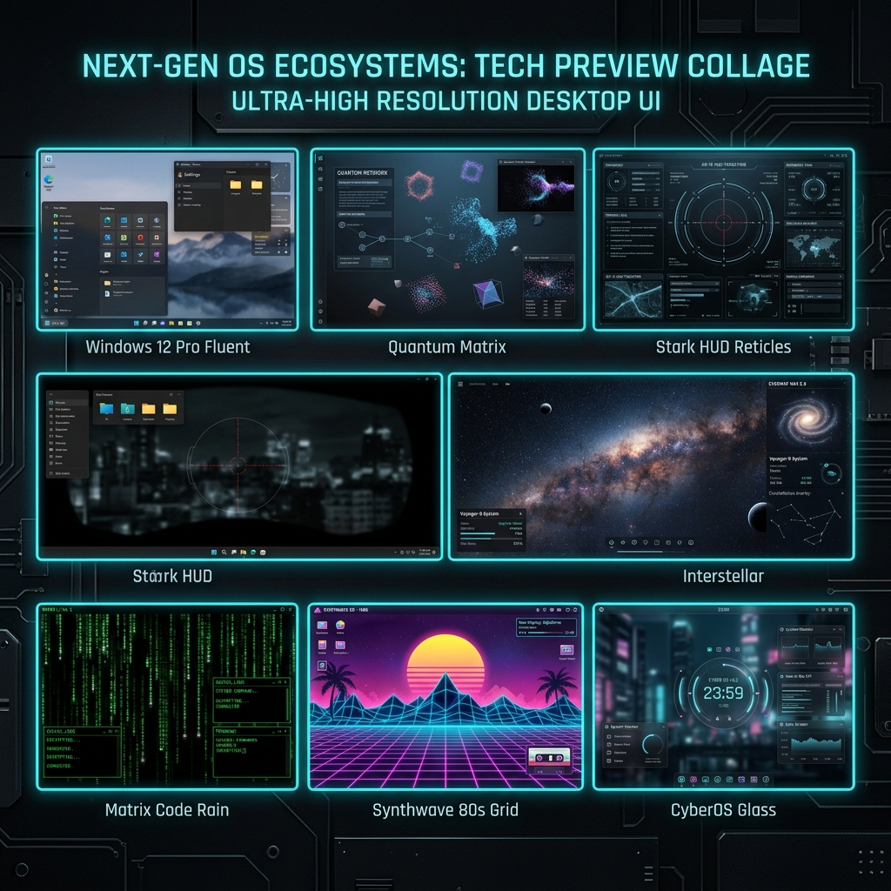

<div align="center">

<table border="0">
  <tr>
    <td align="center" width="220" style="vertical-align: middle; border: none;">
      <br/>
      <h3 style="margin-top: 8px; margin-bottom: 2px;"><b>Santosh Maurya</b></h3>
      <span style="color: #00f0ff; font-size: 12px;"><b>Software Support Engineer & FullStack Developer</b></span><br/>
      <small style="color: #94a3b8;">🎓 B.E. IT (2025 Batch) • SPPU <b>7.99 CGPA</b></small><br/>
      <small style="color: #10b981;">💼 Nevitech Data Solutions Pvt Ltd</small>
    </td>
    <td align="left" style="vertical-align: middle; border: none; padding-left: 20px;">
      <h1>🚀 Multiverse CyberOS v2.088</h1>
      <h3><i>Interactive 7-in-1 Web Operating System Portfolio</i></h3>
      <p>Welcome to my personal developer portfolio! Engineered as a multi-environment Web Operating System featuring 7 distinct desktop modes, glassmorphic window management, interactive CLI terminal, 3D particle constellation canvas, and production full-stack web applications.</p>
      
      <div>
        <a href="https://react.dev/"></a>
        <a href="https://www.typescriptlang.org/"></a>
        <a href="https://vitejs.dev/"></a>
        <a href="https://tailwindcss.com/"></a>
      </div>
    </td>
  </tr>
</table>

</div>

---

## 🖥️ Multiverse OS Desktop Previews

<div align="center">



</div>

### 🎛️ The 7 Interactive OS Environments

| OS Mode | Desktop Visuals & Engine | Core Capabilities |
| :--- | :--- | :--- |
| 🪟 **Windows 12 Pro Edition** | Blue Bloom Wallpaper, Fluent Mica Glass, Centered Taskbar | Windows Start Menu, Pinned Apps Grid, Widgets & System Tray |
| 🌀 **Quantum Neural Matrix v3.0** | 3D Holographic Particle Constellation Canvas | Dynamic 3D Particle Mesh, Laser Synapse Skill Firing |
| 🛡️ **Stark Spatial HUD Mark-88** | JARVIS Tactical Target Reticles & Arc Reactor Glow | Target Reticle Scanning, Arc Reactor Telemetry, Biometrics |
| 🚀 **Interstellar Command System** | Starship Santosh-01 Cockpit & 3D Warp Speed Canvas | Warp-Speed Particle Vectors, Starship Flight Telemetry Log |
| 🟢 **Matrix Code Stream OS** | Real-Time Katakana Digital Code Rain Console | Falling Code Drops, Memory Hex Dump, Hacker CLI Shell |
| 🌇 **Synthwave Outrun 80s OS** | 1980s Sunset Grid Horizon, Cassette Tapes & Arcade | VHS Glitch Filters, Retro Cassette Player, Mini Arcade Cabinet |
| 🖥️ **CyberOS Web Desktop** | Glassmorphic Desktop with Draggable Windows & Taskbar | Z-Index Focus Stack, Drag/Resize Engine, CLI & Audio SFX |

---

## 📦 Featured Production Projects

### 1. 🏥 [Shreyaan Physiotherapy Center](https://www.shreyaanphysiotherapycenter.in/)
> **Full-Stack Healthcare Patient Management & Online Appointment Platform**

* 🔗 **Live Platform**: [www.shreyaanphysiotherapycenter.in](https://www.shreyaanphysiotherapycenter.in/)
* 🛠️ **Tech Stack**: `React` • `TypeScript` • `Tailwind CSS` • `Node.js` • `Express` • `MongoDB` • `WhatsApp API`
* 💡 **Key Features**:
  * Real-time online appointment scheduling & slot booking.
  * Specialized therapy services catalog & treatment package details.
  * Direct WhatsApp inquiry & consultation notifications.
  * High-performance mobile responsive glassmorphic design.

---

### 2. 📊 [SM Core Dashboard & Discord Bot](https://smcoredashboard.vercel.app/login)
> **Full-Stack Automated Discord Bot & Real-Time Analytics Dashboard**

* 🔗 **Live Platform**: [smcoredashboard.vercel.app/login](https://smcoredashboard.vercel.app/login)
* 🛠️ **Tech Stack**: `React` • `TypeScript` • `Node.js` • `Discord.js` • `Vite` • `Tailwind CSS` • `REST API` • `Vercel`
* 💡 **Key Features**:
  * Full working automated Discord bot backend integration.
  * Secure user authentication login & role-based access control.
  * Real-time telemetry monitoring & interactive analytical widget charts.
  * Deployed on Vercel high-speed cloud edge infrastructure.

---

## 👨‍💻 Education & Work Experience

```
+-------------------------------------------------------------------------------+
|  Nevitech Data Solutions Pvt Ltd | Trainee Software Support Engineer           |
|  Jul 2026 - Present (Noida, India)                                            |
|  - Technical support for NCampus Campus Management System                     |
|  - Database querying, module workflow verification, client escalation support  |
+-------------------------------------------------------------------------------+
|  Savitribai Phule Pune University (SPPU) | B.E. Information Technology (2025)  |
|  Grade: 7.99 CGPA                                                             |
|  - Core Focus: DSA, DBMS, Computer Networks, Software Engineering & Web UIs  |
+-------------------------------------------------------------------------------+
```

---

## ⚡ Quick Start & Local Setup

```bash
# 1. Clone the repository
git clone https://github.com/SantoshM5050/PortFolio.git

# 2. Navigate to the project directory
cd PortFolio

# 3. Install dependencies
npm install

# 4. Start the Vite development server
npm run dev
```

Open your browser at `http://localhost:5173/` (or `http://localhost:5175/`).

---

## 🛠️ Production Build & Verification

```bash
# Build production bundle with TypeScript type checks
npm run build

# Preview production bundle locally
npm run preview
```

---

## 📬 Contact & Connect

* 👨‍💻 **Developer**: Santosh Maurya
* 💼 **Current Role**: Trainee Software Support Engineer at **Nevitech Data Solutions**
* 🎓 **Education**: B.E. IT (2025), Savitribai Phule Pune University — **7.99 CGPA**
* 📍 **Location**: Delhi NCR, India
* 🌐 **GitHub Profile**: [github.com/SantoshM5050](https://github.com/SantoshM5050)
* 🔗 **Live Projects**:
  * [Shreyaan Physiotherapy Center](https://www.shreyaanphysiotherapycenter.in/)
  * [SM Core Dashboard & Discord Bot](https://smcoredashboard.vercel.app/login)

---

<div align="center">
  <sub>Built with ❤️ by Santosh Maurya • Powered by React 19 & Vite</sub>
</div>
