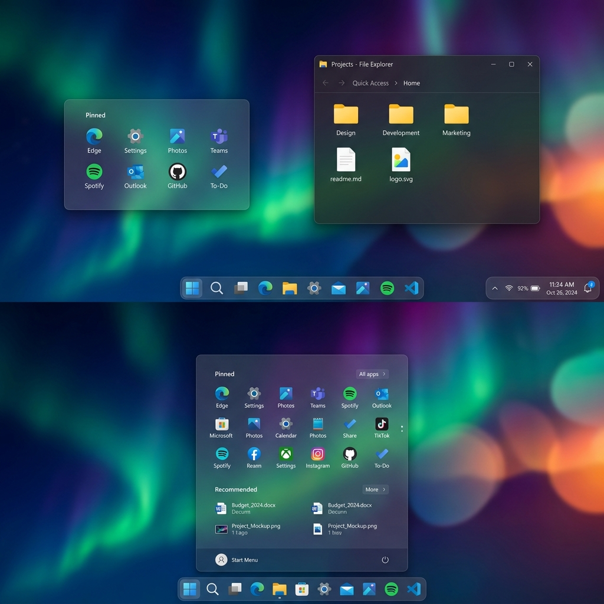
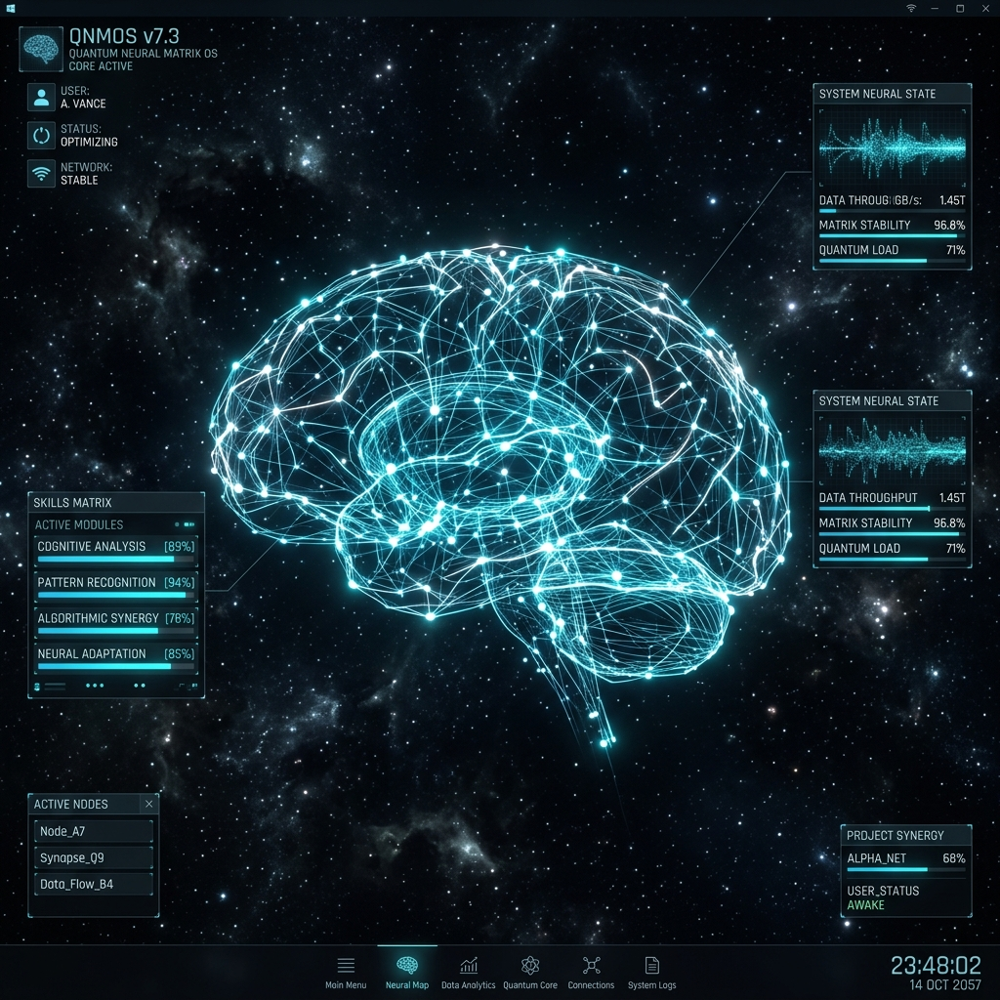
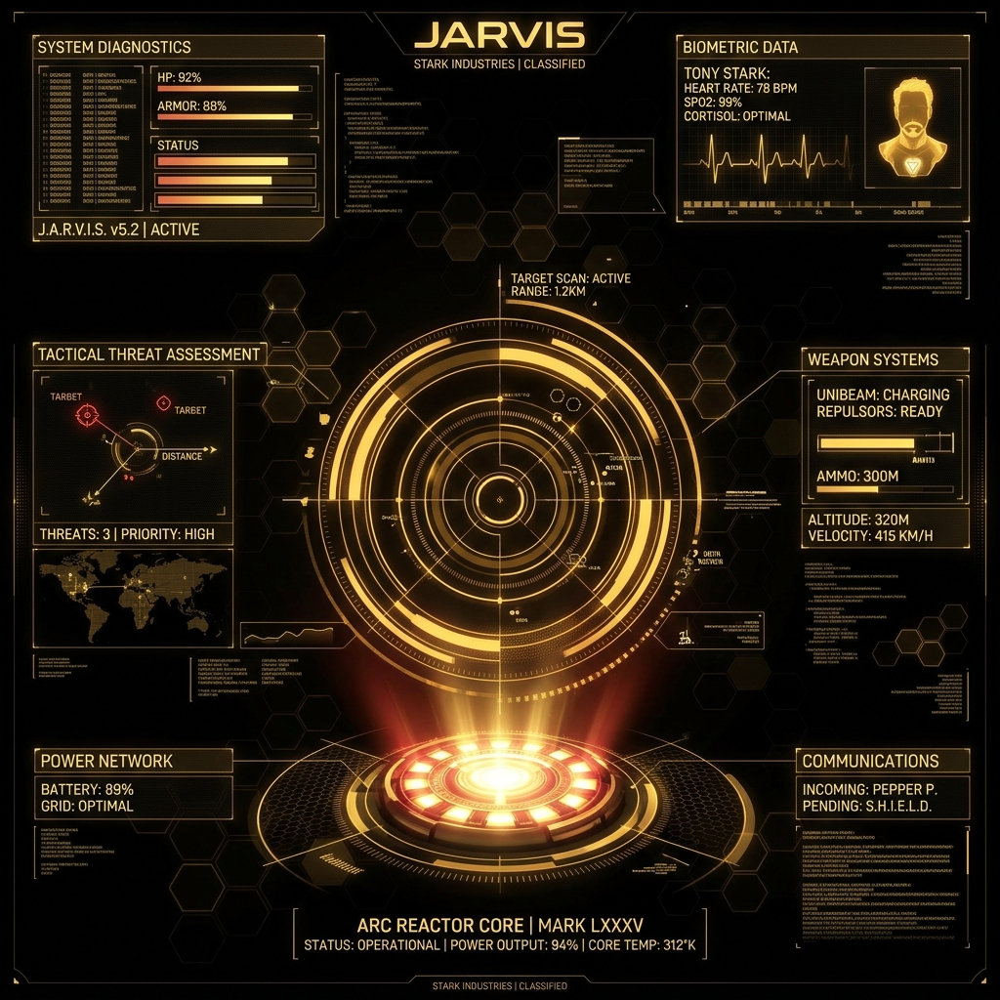
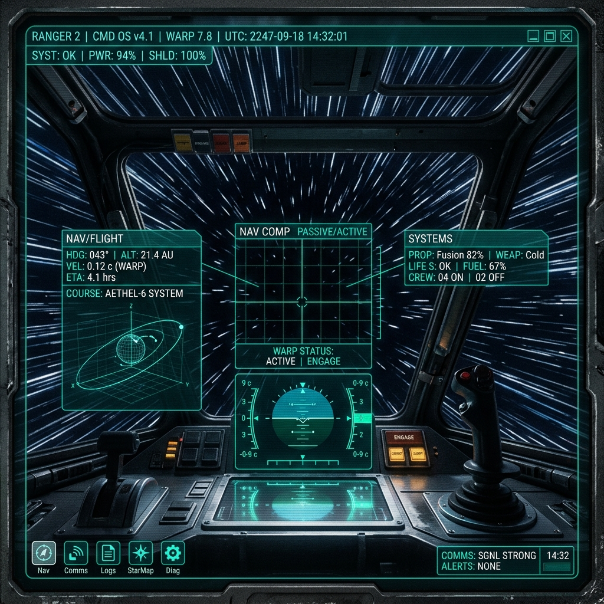
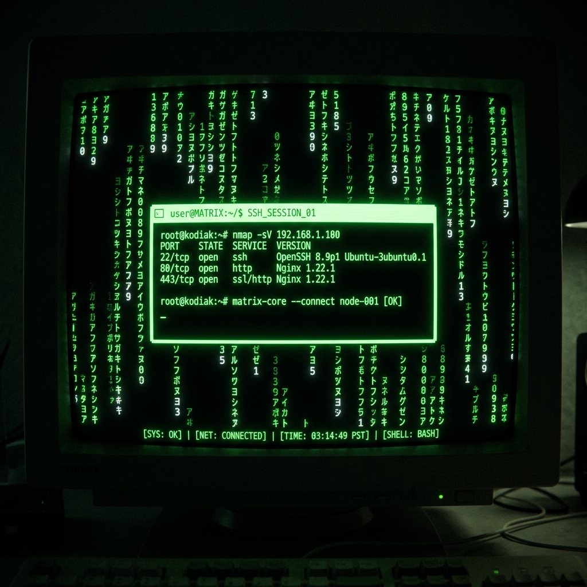
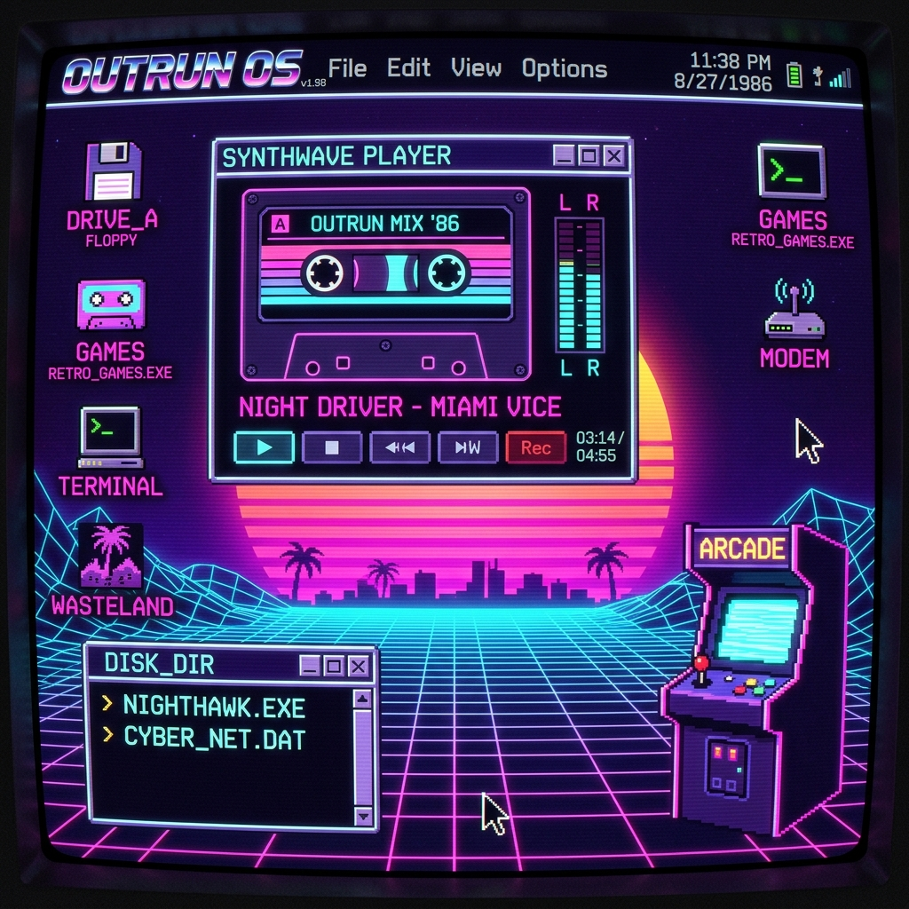
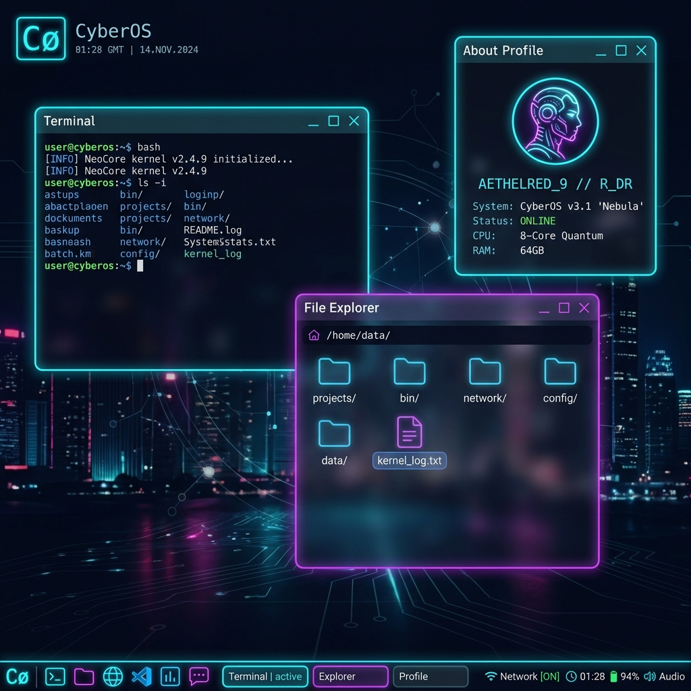

<div align="center">

<table>
<tr>
<td align="center" width="250">
<br/>
<br/><br/>
<h2>Santosh Maurya</h2>
<b>FullStack Developer</b><br/>
<b>Software Support Engineer</b><br/><br/>
<br/>
<br/>
<br/><br/>
<a href="https://github.com/SantoshM5050"></a>
</td>
<td align="center">
<h1>🚀 Multiverse CyberOS v2.088</h1>
<i>Interactive 7-in-1 Web Operating System Portfolio</i><br/><br/>


<br/><br/>
<table>
  <tr>
    <td align="center"><br/><sub><b>🪟 Windows 12 Pro</b></sub></td>
    <td align="center"><br/><sub><b>🌀 Quantum Neural Matrix</b></sub></td>
    <td align="center"><br/><sub><b>🛡️ Stark Spatial HUD</b></sub></td>
  </tr>
  <tr>
    <td align="center"><br/><sub><b>🚀 Interstellar Bridge</b></sub></td>
    <td align="center"><br/><sub><b>🟢 Matrix Code Stream</b></sub></td>
    <td align="center"><br/><sub><b>🌇 Synthwave Outrun 80s</b></sub></td>
  </tr>
</table>
<br/>
<br/><sub><b>🖥️ CyberOS Web Desktop — Glassmorphic Draggable Window Manager</b></sub>
</td>
</tr>
</table>

</div>

---

## 📦 Featured Production Projects

### 1. 🏥 [Shreyaan Physiotherapy Center](https://www.shreyaanphysiotherapycenter.in/)
> **Full-Stack Healthcare Patient Management & Online Appointment Platform**

* 🔗 **Live**: [www.shreyaanphysiotherapycenter.in](https://www.shreyaanphysiotherapycenter.in/)
* 🛠️ **Stack**: `React` · `TypeScript` · `Tailwind CSS` · `Node.js` · `Express` · `MongoDB` · `WhatsApp API`
* ✅ Real-time appointment scheduling, therapy services catalog, WhatsApp notifications, mobile responsive UI.

---

### 2. 📊 [SM Core Dashboard & Discord Bot](https://smcoredashboard.vercel.app/login)
> **Full-Stack Automated Discord Bot & Real-Time Analytics Dashboard**

* 🔗 **Live**: [smcoredashboard.vercel.app/login](https://smcoredashboard.vercel.app/login)
* 🛠️ **Stack**: `React` · `TypeScript` · `Node.js` · `Discord.js` · `Vite` · `Tailwind CSS` · `REST API` · `Vercel`
* ✅ Full working automated Discord bot backend, secure auth login, real-time analytics & telemetry, deployed on Vercel.

---

## 🎛️ OS Environment Breakdown

| OS Mode | Theme | Core Engine |
| :--- | :--- | :--- |
| 🪟 **Windows 12 Pro** | Mica Glass, Centered Taskbar, Aurora Wallpaper | Start Menu, Widgets, System Tray |
| 🌀 **Quantum Neural Matrix** | 3D Holographic Particle Constellation | Canvas 3D Node Mesh, Skill Synapse Firing |
| 🛡️ **Stark Spatial HUD** | JARVIS Tactical Reticles, Arc Reactor Glow | Target Scan, Telemetry, Biometrics |
| 🚀 **Interstellar Bridge** | Starship Cockpit, Warp Speed Canvas | Particle Vectors, Flight Log |
| 🟢 **Matrix Code Stream** | Katakana Digital Rain, Hacker CLI | Falling Code Canvas, Hex Dump, Shell |
| 🌇 **Synthwave Outrun 80s** | Neon Grid Sunset, Cassette Deck | VHS Filters, Retro Player, Arcade |
| 🖥️ **CyberOS Web Desktop** | Glassmorphic Draggable Windows | Z-Index Stack, Drag/Resize, Audio SFX |

---

## ⚡ Quick Start

```bash
git clone https://github.com/SantoshM5050/PortFolio.git
cd PortFolio
npm install
npm run dev
```

Open `http://localhost:5173/` in your browser.

```bash
# Production build
npm run build
```

---

## 👨‍💻 Background

```
💼  Trainee Software Support Engineer — Nevitech Data Solutions Pvt Ltd (Jul 2026 – Present)
     Supporting NCampus Campus Management System | Database Queries | Client Escalations

🎓  B.E. Information Technology — Savitribai Phule Pune University (SPPU) | 2025 Batch
     7.99 CGPA | DSA · DBMS · Computer Networks · Software Engineering · Full-Stack Web Dev

📍  Delhi NCR, India
🌐  github.com/SantoshM5050
```

---

<div align="center">
  <sub>Built with ❤️ by Santosh Maurya • React 19 + TypeScript + Vite</sub>
</div>
